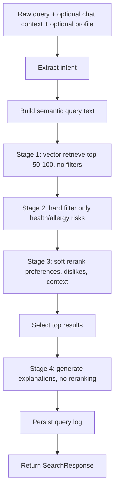

# Semantic-First Search Refactor Plan

**Status:** Proposed
**Branch:** `docs/semantic-first-refactor-plan`
**Owner:** Backend / AI pipeline
**Goal:** Replace the current filter-first food recommendation flow with a semantic-first hybrid pipeline while preserving medical and allergy safety.

## Why This Refactor Exists

The current pipeline applies hard filters and priority sorting before semantic retrieval has a chance to collect a broad candidate pool. That makes results sensitive to imperfect JSON tags and can produce top 5 lists where only the first few foods are truly related. The new flow retrieves semantically relevant foods first, then applies critical medical safety, then reranks the remaining safe candidates with transparent scoring.

The refactor must preserve these behaviors:

- Critical medical and allergy constraints are absolute.
- User dislikes and meal context should influence ranking, not delete foods.
- The response shape should stay compatible with the existing frontend.
- Query logs must explain why each item was retrieved, filtered, reranked, or returned.

## Current Entry Points

| Flow | Current path | Notes |
| --- | --- | --- |
| Direct search | `GET /foods/search` | Calls `search_food()` after optional health profile augmentation. |
| Chat search | `POST /chat/threads/{thread_id}/messages` | Saves user message, builds recent context, applies profile unless skipped, then calls `search_food()`. |
| Search implementation | `app/modules/search/service.py` | Current extraction, filtering, scoring, post-processing live in one large module. |
| Ingredient keys | `app/modules/ingredients/service.py` | Shared alias/key generation used by seed, search, and admin workflows. |
| Embedding text | `app/integrations/vertex_ai.py` | Builds text used to generate document embeddings. |
| Query logs | `app/modules/query_logs/service.py` | Persists trace fields in `QueryLog.excluded_summary`. |

## Target Pipeline



## Recommended Libraries

Use the existing stack first:

- `pgvector` + SQLAlchemy for semantic vector search.
- `numpy` for score math where needed.
- `pytest` and `pytest-asyncio` for characterization and pipeline tests.
- `google-genai` for Gemini extraction, embedding, and post-processing.

Add only if needed:

- `bm25s` for optional sparse retrieval after the semantic-first baseline works.

Avoid adding LangChain for the core pipeline right now. The current need is clearer orchestration and deterministic scoring, not another abstraction layer.

## Proposed Module Layout

Create a pipeline package and keep compatibility with existing router/service imports:

```text
app/modules/search/
├── service.py                  # public search_food wrapper + legacy/semantic feature flag
├── pipeline/
│   ├── __init__.py
│   ├── types.py                # Intent, RetrievedFood, SafetyDecision, ScoredFood
│   ├── intent.py               # supervisor wrapper + fallback extraction normalization
│   ├── retrieval.py            # vector retrieval top_k, no filters
│   ├── safety.py               # health/allergy hard filtering
│   ├── scoring.py              # soft bonus/penalty math
│   ├── explanation.py          # deterministic reason + post-processing prompt guard
│   └── orchestrator.py         # semantic_first_search_food()
└── safety.py                   # existing allergy text helpers, keep and reuse
```

## Configuration

Add these settings to `.env.example` and `app/core/config.py`:

```text
SEARCH_PIPELINE_VERSION=legacy
SEMANTIC_RETRIEVAL_TOP_K=100
SEMANTIC_MIN_SCORE=0.0
SEARCH_RETURN_LIMIT=5
```

`SEARCH_PIPELINE_VERSION=legacy` should remain the default until the new pipeline passes evaluation.

## Execution Roadmap

This roadmap is the implementation order for engineering work. Each PR should leave the backend importable and runnable. Do not switch production traffic to the semantic-first pipeline until PR 7 is complete and the evaluation cases pass.

### Branch Strategy

Use one implementation branch for the full refactor, with small PRs if the team workflow supports stacked changes:

```text
feature/semantic-first-search-pipeline
```

If stacked PRs are used, keep the order below. If a single PR is required, keep these as separate commits so review can still follow the migration.

### PR / Commit Sequence

| Order | PR or commit | Main files | Purpose | Required verification |
| --- | --- | --- | --- | --- |
| 1 | `test: add search pipeline characterization cases` | `tests/`, `requirements.txt` | Add test safety net and deterministic fixtures before behavior changes. | `python3 -m compileall -q app main.py`; `python3 -m pytest` |
| 2 | `refactor: add semantic pipeline types and feature settings` | `app/core/config.py`, `.env.example`, `app/modules/search/pipeline/types.py` | Add typed contracts and config with default `legacy`. | Compile and import checks |
| 3 | `feat: add filter-free semantic retrieval stage` | `app/modules/search/pipeline/retrieval.py` | Retrieve top 50-100 candidates by vector similarity only. | Retrieval unit tests with mocked embeddings |
| 4 | `feat: add critical safety filtering stage` | `app/modules/search/pipeline/safety.py` | Reject only health/allergy risks after retrieval. | Safety tests for gout, allergy, and dislike non-rejection |
| 5 | `feat: add soft scoring and reranking stage` | `app/modules/search/pipeline/scoring.py` | Apply preference/context bonuses and disliked penalties. | Scoring tests with score breakdown assertions |
| 6 | `feat: wire semantic-first orchestrator behind feature flag` | `app/modules/search/service.py`, `app/modules/search/pipeline/orchestrator.py` | Route `search_food()` to legacy or semantic-first by config. | Run tests with both pipeline modes |
| 7 | `feat: log semantic-first trace and lock explanation order` | `app/modules/search/pipeline/explanation.py`, `app/modules/query_logs/service.py` | Persist retrieval/safety/scoring trace and prevent LLM reorder. | Query log and explanation tests |
| 8 | `feat: align food embedding text for semantic retrieval` | `app/integrations/vertex_ai.py`, seed/admin docs | Improve document text used for embeddings and add rebuild notes. | Compile, limited embedding dry run |

### Dependency Order

```text
PR 1 -> PR 2
PR 2 -> PR 3
PR 2 -> PR 4
PR 2 -> PR 5
PR 3 + PR 4 + PR 5 -> PR 6
PR 6 -> PR 7
PR 6 -> PR 8
```

PR 3, PR 4, and PR 5 can be developed in parallel after PR 2 if file ownership stays clean. PR 6 is the integration point and should be reviewed carefully.

### Scope Lock

Touch:

- `app/modules/search/service.py`
- `app/modules/search/pipeline/*`
- `app/modules/search/safety.py` only if allergy helper reuse needs a small extraction
- `app/modules/ingredients/service.py` only for key generation adapter tests
- `app/integrations/vertex_ai.py` only in PR 8
- `app/core/config.py`
- `.env.example`
- `requirements.txt`
- search-related tests and fixtures

Do not touch:

- Auth behavior
- Chat thread persistence behavior
- Admin CRUD behavior
- Frontend response shape
- Database model schema, unless a later decision explicitly adds telemetry columns

### Rollout Plan

1. Merge PRs with `SEARCH_PIPELINE_VERSION=legacy` as default.
2. Enable `semantic_first` locally with mocked or test embeddings.
3. Enable `semantic_first` in a staging environment.
4. Run the evaluation fixture and manually inspect at least 20 query logs.
5. Rebuild embeddings after PR 8 if semantic retrieval quality is weak.
6. Switch production only after safety and relevance checks pass.
7. Keep the legacy code path for one release cycle.
8. Delete or archive legacy code only after query logs show stable behavior.

### Rollback Plan

Fast rollback is config-only:

```text
SEARCH_PIPELINE_VERSION=legacy
```

If embedding text rebuild causes poor retrieval quality, keep the semantic-first code disabled and rebuild embeddings using the previous text builder before retrying rollout.

### Implementation Checklog

Use this table during execution. Update it at the end of each PR or commit.

| Item | Status | Evidence | Notes |
| --- | --- | --- | --- |
| Test fixtures created | Not started |  |  |
| Legacy pipeline still available | Not started |  |  |
| Feature flag defaults to `legacy` | Not started |  |  |
| Semantic retrieval has no filters | Not started |  |  |
| Safety filter uses only health/allergy constraints | Not started |  |  |
| Dislikes are penalties, not hard filters | Not started |  |  |
| Meal and occasion are bonuses, not hard filters | Not started |  |  |
| Query logs include retrieval trace | Not started |  |  |
| Explanation prompt cannot reorder top results | Not started |  |  |
| Staging eval cases pass | Not started |  |  |
| Production rollback is config-only | Not started |  |  |

## Phase Plan

### Phase 0: Baseline And Characterization

**Objective:** Capture current behavior before changing ranking logic.

Tasks:

- Add test dependencies to `requirements.txt`.
- Add tests for ingredient key generation and allergy text fallback.
- Add a small eval fixture of real user queries and expected safety/relevance assertions.
- Mock LLM and embedding calls so tests are deterministic.
- Store expected query cases in `standard-data/testing_data/search_eval_cases.json` or `tests/fixtures/search_eval_cases.json`.

Verification:

```bash
python3 -m compileall -q app main.py
python3 -m pytest
```

Exit criteria:

- Tests can run without external Gemini calls.
- At least 10 search cases describe expected safety and relevance behavior.
- No production behavior changes yet.

Rollback:

- Remove the new tests/fixtures and dependency additions.

### Phase 1: Typed Pipeline Boundaries

**Objective:** Introduce explicit pipeline types without changing behavior.

Tasks:

- Create `app/modules/search/pipeline/types.py`.
- Define `ExtractedIntent`, `RetrievedFood`, `CriticalSafetyRules`, `SafetyDecision`, `ScoredFood`, and `PipelineTrace`.
- Normalize naming away from mixed fields such as `final_p_ings` into domain terms:
  - `critical_excluded_ingredient_keys`
  - `preferred_ingredient_keys`
  - `disliked_ingredient_keys`
  - `medical_prefer_tags`
  - `soft_context_tags`
- Keep current `SearchResponse` unchanged.

Verification:

```bash
python3 -m compileall -q app main.py
```

Exit criteria:

- New types import cleanly.
- No route or response contract changes.

Rollback:

- Delete `app/modules/search/pipeline/types.py`.

### Phase 2: Semantic Retrieval Stage

**Objective:** Add vector retrieval before any filters.

Tasks:

- Create `app/modules/search/pipeline/retrieval.py`.
- Implement `build_semantic_query_text(intent, query)`.
- Implement `semantic_retrieve_foods(db, query_vector, top_k)`.
- Use pgvector cosine distance against `Food.embedding`.
- Return `RetrievedFood(food, semantic_score, retrieval_rank)`.
- Do not filter by ingredient, tag, disease, meal context, or disliked preferences.

Pseudo-code:

```python
async def semantic_retrieve_foods(db, query_vector, top_k):
    distance = Food.embedding.cosine_distance(query_vector)
    rows = await db.execute(
        select(Food, (1.0 - distance).label("semantic_score"))
        .where(Food.embedding.is_not(None))
        .order_by(distance.asc())
        .limit(top_k)
    )
    return [
        RetrievedFood(food=row.Food, semantic_score=row.semantic_score, retrieval_rank=i + 1)
        for i, row in enumerate(rows)
    ]
```

Verification:

```bash
python3 -m compileall -q app main.py
python3 -m pytest tests/search
```

Exit criteria:

- Retrieval returns up to `top_k` candidates with semantic scores.
- Retrieval trace includes retrieved count and top candidate names.
- No safety or preference logic exists inside retrieval.

Rollback:

- Remove `retrieval.py` and any isolated tests for it.

### Phase 3: Critical Safety Filter

**Objective:** Move hard filtering to a dedicated stage and limit it to medical/allergy constraints.

Tasks:

- Create `app/modules/search/pipeline/safety.py`.
- Build `CriticalSafetyRules` only from `health_constraints` and DB `tags`.
- Convert critical excluded ingredients to keys using `generate_filter_keys()`.
- Reuse existing allergy text detection from `app/modules/search/safety.py`.
- Reject only candidates that match:
  - critical ingredient keys,
  - critical medical tags,
  - allergy text fallback phrases.
- Do not reject based on disliked preferences or meal context.

Pseudo-code:

```python
def apply_critical_safety_filter(candidates, rules):
    safe = []
    rejected = []

    for candidate in candidates:
        decision = evaluate_food_safety(candidate.food, rules)
        if decision.reject:
            rejected.append(RejectedFood(candidate=candidate, decision=decision))
        else:
            safe.append(candidate)

    return safe, rejected
```

Verification:

```bash
python3 -m pytest tests/search/test_safety.py
```

Exit criteria:

- Gout/seafood and allergy cases are rejected after retrieval.
- User dislike cases are not rejected.
- Rejection reasons are structured for query logs.

Rollback:

- Remove `safety.py` and tests.

### Phase 4: Soft Scoring And Reranking

**Objective:** Replace hard preference/context filters with score math.

Tasks:

- Create `app/modules/search/pipeline/scoring.py`.
- Compute `final_score = semantic_score + bonuses - penalties`.
- Use semantic score as backbone.
- Apply small positive weights for preferred ingredients/tags/context.
- Apply medium negative weights for disliked ingredients/tags.
- Add caps to avoid tag scores overpowering semantic relevance.
- Remove boolean priority sorting from the new path.

Suggested weights:

| Signal | Weight |
| --- | ---: |
| Meal context match | `+0.02` |
| Occasion context match | `+0.02` |
| Preferred ingredient match | `+0.04` |
| Preferred tag match | `+0.02` |
| Medical prefer tag match | `+0.02` |
| Disliked ingredient match | `-0.15` |
| Disliked tag match | `-0.10` |

Pseudo-code:

```python
def score_candidate(candidate, intent, safety_rules):
    semantic = candidate.semantic_score
    bonus = 0.0
    penalty = 0.0
    signals = []

    if overlaps(candidate.food.meal_context, intent.meal_context):
        bonus += 0.02
        signals.append("meal_context_match")

    if overlaps(candidate.food.core_ingredient_keys, intent.preferred_ingredient_keys):
        bonus += 0.04
        signals.append("preferred_ingredient_match")

    if overlaps(candidate.food.core_ingredient_keys, intent.disliked_ingredient_keys):
        penalty += 0.15
        signals.append("disliked_ingredient_penalty")

    final_score = clamp(semantic + min(bonus, 0.12) - min(penalty, 0.30), 0.0, 1.0)
    return ScoredFood(candidate.food, semantic, final_score, signals)
```

Verification:

```bash
python3 -m pytest tests/search/test_scoring.py
```

Exit criteria:

- Disliked foods drop in rank but are not deleted.
- Context matches improve rank without over-filtering.
- Semantic score remains the dominant ranking factor.

Rollback:

- Remove `scoring.py` and tests.

### Phase 5: Semantic-First Orchestrator Behind Feature Flag

**Objective:** Wire the new stages into a complete pipeline without deleting legacy behavior.

Tasks:

- Create `app/modules/search/pipeline/orchestrator.py`.
- Rename current implementation internally to `search_food_legacy()`.
- Keep public `search_food()` as the stable entrypoint.
- Route by `settings.search_pipeline_version`.
- Preserve `SearchResponse` fields.
- Persist query logs for both legacy and semantic-first paths.

Pseudo-code:

```python
async def search_food(query, db, thread_id=None, debug=False):
    if settings.search_pipeline_version == "semantic_first":
        return await semantic_first_search_food(query, db, thread_id=thread_id, debug=debug)
    return await search_food_legacy(query, db, thread_id=thread_id, debug=debug)
```

Verification:

```bash
SEARCH_PIPELINE_VERSION=legacy python3 -m pytest
SEARCH_PIPELINE_VERSION=semantic_first python3 -m pytest tests/search
```

Exit criteria:

- Legacy behavior remains available.
- New behavior can be enabled per environment.
- No frontend contract changes.

Rollback:

- Set `SEARCH_PIPELINE_VERSION=legacy`.
- Remove orchestrator import if needed.

### Phase 6: Explanation Generation Without Reordering

**Objective:** Ensure the AI response explains the ranked result list and never mutates it.

Tasks:

- Create `app/modules/search/pipeline/explanation.py`.
- Keep deterministic `FoodResult.reason` based on `score_breakdown`.
- Update post-processing prompt:
  - Do not add foods.
  - Do not remove foods.
  - Do not reorder foods.
  - Do not call all foods absolutely safe.
- Include score signals in the prompt, but not raw embeddings.

Verification:

```bash
python3 -m pytest tests/search/test_explanation.py
```

Exit criteria:

- AI response mentions only foods in top results.
- Food order in response matches mathematical ranking.
- Unsafe language is avoided for medically sensitive queries.

Rollback:

- Restore old post-processing prompt.

### Phase 7: Query Log And Observability

**Objective:** Make failures explainable.

Tasks:

- Extend `excluded_summary` JSON structure with semantic-first trace.
- Log:
  - retrieval top_k,
  - retrieved count,
  - rejected safety candidates,
  - safe count,
  - scoring breakdown,
  - returned top results,
  - pipeline version.
- Keep schema compatible because `excluded_summary` is JSONB.

Example:

```json
{
  "pipeline_version": "semantic_first",
  "retrieval": {
    "top_k": 100,
    "retrieved_count": 100
  },
  "safety_filter": {
    "rejected_count": 12,
    "rejected_examples": []
  },
  "scoring": {
    "top_results": []
  }
}
```

Verification:

```bash
python3 -m pytest tests/search/test_query_log_trace.py
```

Exit criteria:

- Admin can inspect why each top result was returned.
- Query logs show whether a bad result came from retrieval, scoring, or missing data.

Rollback:

- Stop writing semantic-first trace fields.

### Phase 8: Embedding Text Alignment And Rebuild

**Objective:** Make embeddings reflect food meaning, not just tags.

Tasks:

- Update `build_food_embed_text()` to prioritize:
  - name,
  - description,
  - core ingredients,
  - raw ingredients,
  - short cooking/instruction summary if useful,
  - tags as secondary metadata.
- Add admin/runbook instructions for rebuilding embeddings.
- Rebuild embeddings in a controlled environment.

Verification:

```bash
python3 -m compileall -q app main.py
python3 -m app.db.seed --embeddings --embedding-limit 5
```

Exit criteria:

- Newly embedded foods produce better semantic retrieval.
- Existing DB can be rebuilt without resetting unrelated fields.

Rollback:

- Revert embedding text builder and rebuild from the previous format if necessary.

## Implementation Checklist

Use this checklist as the delivery tracker.

| Phase | Status | Owner | Notes |
| --- | --- | --- | --- |
| Phase 0: Baseline tests | Implemented | Codex | Added deterministic unit tests for safety, soft penalties, context bonus, ranking order, and explanation guardrails. |
| Phase 1: Pipeline types | Implemented | Codex | Added semantic-first dataclasses under `app/modules/search/pipeline/types.py`. |
| Phase 2: Semantic retrieval | Implemented | Codex | Added wide vector retrieval plus no-filter lexical fallback under `pipeline/retrieval.py`. |
| Phase 3: Critical safety filter | Implemented | Codex | Added medical/allergy-only safety filter under `pipeline/safety.py`. |
| Phase 4: Soft scoring | Implemented | Codex | Added deterministic bonus/penalty scoring under `pipeline/scoring.py`; dislikes are penalties, not deletes. |
| Phase 5: Feature-flagged orchestrator | Implemented | Codex | Added `semantic_first_search_food()` and feature flag wrapper in `search_food()`. Default remains `legacy`. |
| Phase 6: Explanation guard | Implemented | Codex | Added generation guardrails and updated post-processing prompt to forbid add/remove/reorder. |
| Phase 7: Query log trace | Implemented | Codex | Semantic-first query logs now include retrieval, critical safety, scoring, and LLM runtime trace. |
| Phase 8: Embedding text rebuild | Implemented | Codex | Updated `build_food_embed_text()` to include raw ingredients and cooking instructions; rebuild still requires controlled DB run. |

## Change Checklog

Append every implementation change here. Keep entries short and factual.

| Date | Phase | Change | Verification | Result |
| --- | --- | --- | --- | --- |
| 2026-06-02 | Planning | Created semantic-first refactor plan | N/A | Proposed |
| 2026-06-02 | Planning | Added execution roadmap, rollout plan, and implementation checklog | N/A | Proposed |
| 2026-06-02 | Phase 0 | Added `tests/search/test_semantic_pipeline.py` | `python3 -m pytest tests/search/test_semantic_pipeline.py` | Passed, 5 tests |
| 2026-06-02 | Phase 1-4 | Added semantic-first `types`, `retrieval`, `safety`, `scoring`, and `explanation` modules | `python3 -m pytest tests/search/test_semantic_pipeline.py`; `python3 -m compileall -q app main.py` | Passed |
| 2026-06-02 | Phase 5 | Added feature-flagged `search_food()` wrapper and preserved `search_food_legacy()` | `python3 -m compileall -q app main.py` | Passed |
| 2026-06-02 | Phase 6-7 | Added generator-only guardrails and semantic-first query log trace fields | `python3 -m compileall -q app main.py` | Passed |
| 2026-06-02 | Phase 8 | Updated food embedding text with raw ingredients and cooking instructions; added rollout env vars | `python3 -m compileall -q app main.py` | Passed |

## Current Rollout Notes

- Default runtime remains `SEARCH_PIPELINE_VERSION=legacy`.
- Enable the new flow with `SEARCH_PIPELINE_VERSION=semantic_first`.
- Rebuild embeddings after deploying the updated `build_food_embed_text()`; otherwise old vectors will not fully benefit from raw ingredient/instruction text.
- Local verification used unit tests and compile checks. A direct runtime import of the full app still requires installing dependencies from `requirements.txt` such as `SQLAlchemy`, `email-validator`, and `google-genai`.

## Acceptance Criteria

The refactor is complete when:

- `SEARCH_PIPELINE_VERSION=semantic_first` can serve direct search and chat search.
- Medical/allergy unsafe foods are rejected after semantic retrieval.
- Disliked preferences reduce score but do not delete candidates.
- Meal context and occasion context affect score without over-filtering.
- Post-processing does not add, remove, or reorder foods.
- Query logs explain retrieval, safety filtering, scoring, and returned results.
- Evaluation cases pass with both deterministic tests and manual review.

## Risks And Mitigations

| Risk | Mitigation |
| --- | --- |
| Semantic top 100 misses exact ingredient intent | Add optional BM25/sparse retrieval after baseline semantic-first is stable. |
| Tags overpower semantic relevance | Cap bonus and penalty totals. Keep semantic score as ranking backbone. |
| Safety false negatives | Keep ingredient key hard filter plus allergy text fallback. |
| Safety false positives | Only hard filter health/allergy constraints, not disliked preferences. |
| LLM explanation changes ranking | Deterministic ranking happens before prompt; prompt explicitly forbids mutation. |
| Existing frontend breaks | Preserve `SearchResponse` shape and `food.reason`. |

## Optional Go Interface Shape

If the same pipeline is implemented in Go, keep the same stage boundaries:

```go
type SearchPipeline interface {
    ExtractIntent(query string) (Intent, error)
    SemanticRetrieve(query string, topK int) ([]RetrievedFood, error)
    ApplySafety([]RetrievedFood, Intent) ([]RetrievedFood, []RejectedFood)
    Rerank([]RetrievedFood, Intent) []ScoredFood
    Explain(query string, top5 []ScoredFood) (string, error)
}
```

The important part is not the language. The important part is the stage contract:

1. Retrieval is wide and filter-free.
2. Safety is hard and medical-only.
3. Preferences are math-based scoring.
4. Explanation is generation-only.
